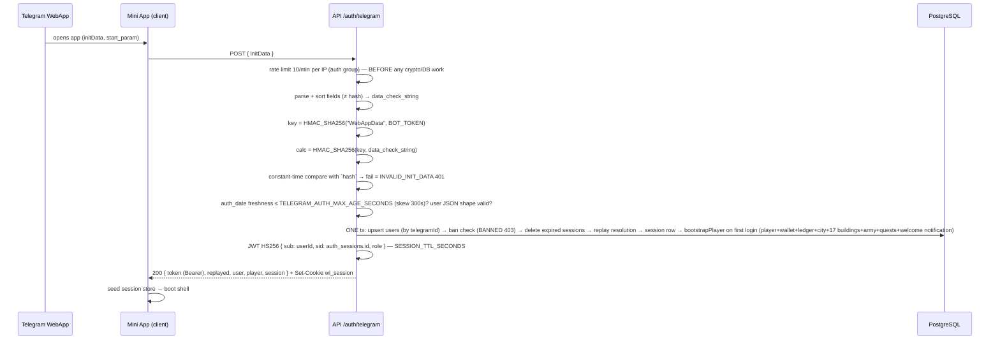
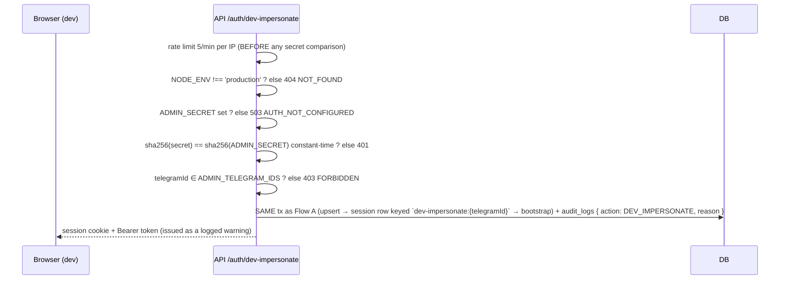
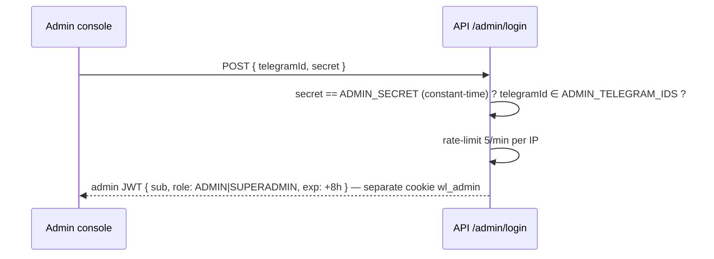

# WARLORDS — Authentication Architecture

> ✅ Implemented in **Phase 3** (`src/lib/auth`, `src/lib/telegram`, `/api/v1/auth/*`) · Zero custom crypto — everything below is Telegram-official + node stdlib. Flow C (admin login) remains Phase 9.

---

## 1. Identity Model

| Concept | Storage | Rule |
|---|---|---|
| **Identity** | `users.telegramId` (unique, int64-as-string) | username is display-only, NEVER identity |
| **Game persona** | `players` (1:1 user) | bootstrapped in the SAME tx as the session on first login |
| **Session** | JWT HS256 **+ `auth_sessions` row** (sha256 tokenHash, revocable), TTL `SESSION_TTL_SECONDS` (default 7d), sliding refresh within 48h of expiry | cookie `wl_session` HttpOnly+SameSite=Lax+Path=/ (Secure in production) or `Authorization: Bearer` |
| **Roles** | `users.role` ∈ USER·ADMIN·SUPERADMIN | `role` in the JWT is observability ONLY — role/ban are re-read from the DB on EVERY request |

Code map: `lib/telegram/init-data.ts` (pure verification) · `lib/auth/` (`session.service` = Flow A/B core, `guard.ts` = `requireAuth`, `jwt.ts`, `cookies.ts`, `hash.ts`) · `lib/rate-limit/`.

## 2. Flow A — Mini App Login (primary, implemented)

Notes:
- `initData` travels in the request **body** and is accepted once — never echoed, logged (logger redacts `initData`) or stored raw; only `sha256(initData)` is persisted as `auth_sessions.initDataHash` (unique).
- Verification failures → `INVALID_INIT_DATA` (401) with `details.reason` (`empty|too_long|missing_hash|missing_auth_date|invalid_auth_date|invalid_hash|auth_date_in_future|expired|missing_user|invalid_user`). Stale `auth_date` → same code with `reason: expired` (client re-opens the app to refresh).
- **Replay policy:** a byte-identical initData re-attaches to the SAME `auth_sessions` row (unique `initDataHash`) and **rotates the token hash** — no second session can be farmed, the old token is invalidated immediately, and legitimate network retries never lock users out (`replayed: true` in the response). A **fresh** initData (new `auth_date`) mints a new session.
- Sliding refresh: protected requests with `expiresAt - now < 48h` (`SESSION_REFRESH_THRESHOLD_SECONDS`) re-issue the token (Set-Cookie + `refreshed.token` on `/auth/me`).
- Every subsequent request: `requireAuth` → Bearer header, else cookie → JWT verify → session row (token-hash match + `revokedAt` + expiry) → ban check from DB (`users.isBanned`, `banExpiresAt` for temp bans). There is **no Next.js edge `middleware.ts`** — the edge runtime cannot run Prisma and the ban check must hit the DB on every request; the guard composes into each route.

## 3. Flow B — Dev Impersonation (non-production ONLY, implemented)

`POST /api/v1/auth/dev-impersonate` — body `{ telegramId, secret, reason? }`. Guard chain, in order:

Purpose: exercise the Mini App in a plain browser during development. **Compiled out of production behavior** (route returns 404 when `NODE_ENV=production`). The synthetic `initDataHash` (`dev-impersonate:{telegramId}`) means repeated impersonation of the same id re-attaches to one audited session. The dev user is auto-created and fully bootstrapped.

## 4. Flow C — Admin Login *(designed — Phase 9, not yet implemented)*

Admin cookie is **separate** from player session (an admin browsing the game as player never carries admin powers in the player context). All admin routes require the admin cookie + role guard + audit.

## 5. Guards & Failure Map (Phase 3 actuals)

| Check | Failure code |
|---|---|
| missing token (no Bearer, no cookie) | `UNAUTHORIZED` (401) |
| malformed/garbage/foreign-secret JWT | `UNAUTHORIZED` (401) |
| valid JWT but session row unknown or token hash mismatch | `UNAUTHORIZED` (401) |
| JWT `exp` elapsed | `SESSION_EXPIRED` (401) |
| session row revoked (logout) | `SESSION_REVOKED` (401) |
| bad initData (signature/age/shape — see `details.reason`) | `INVALID_INIT_DATA` (401) |
| banned user at exchange (tx rolls back) or on any request | `BANNED` (403, + reason/expiry in details) |
| rate limit exceeded (auth 10/min · dev-impersonate 5/min per IP) | `RATE_LIMITED` (429, + `retryAfterSec`) |
| `JWT_SECRET`/`TELEGRAM_BOT_TOKEN` missing (dev), `ADMIN_SECRET` missing | `AUTH_NOT_CONFIGURED` (503) |
| dev-impersonate called in production / telegramId not allowlisted | `NOT_FOUND` (404) / `FORBIDDEN` (403) |

Later phases add route guards on top of `requireAuth` (`FORBIDDEN` role checks, `CLAN_ROLE_REQUIRED`) — taxonomy already reserved in `lib/api/errors.ts`.

## 6. Secrets & tunables (summary — full register in SECURITY.md §5)

`JWT_SECRET` ≥32 random bytes and `TELEGRAM_BOT_TOKEN` are **REQUIRED in production** (fail-fast at env load); in dev their absence boots the server but auth endpoints answer `AUTH_NOT_CONFIGURED` (503). `JWT_SECRET` rotation kills all sessions (acceptable, documented). `ADMIN_SECRET` is never a bearer token by itself — always paired with the allowlisted telegramId. `TELEGRAM_BOT_TOKEN` is used for HMAC derivation + Bot API only, server-side only. Tunables: `TELEGRAM_AUTH_MAX_AGE_SECONDS` (initData freshness bound, default 86400 = 24h) and `SESSION_TTL_SECONDS` (session lifetime, default 604800 = 7d).
