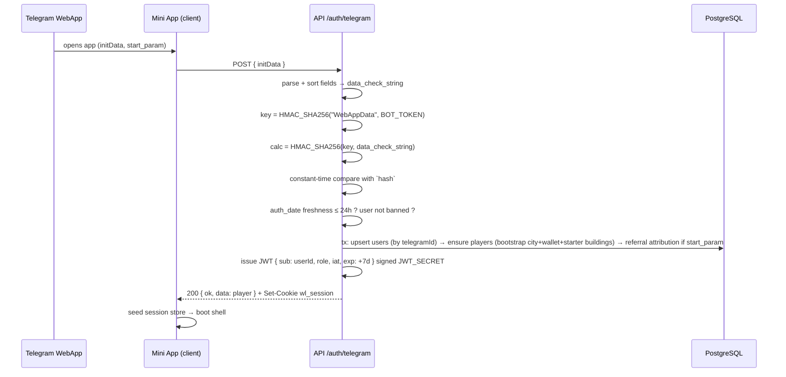
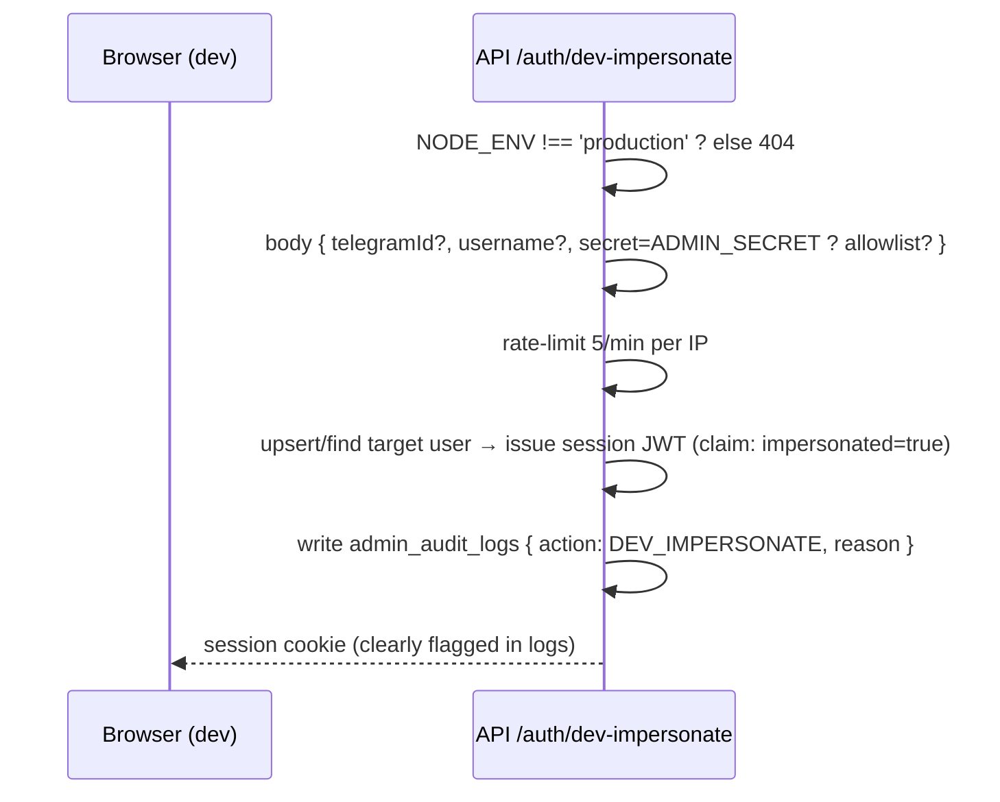
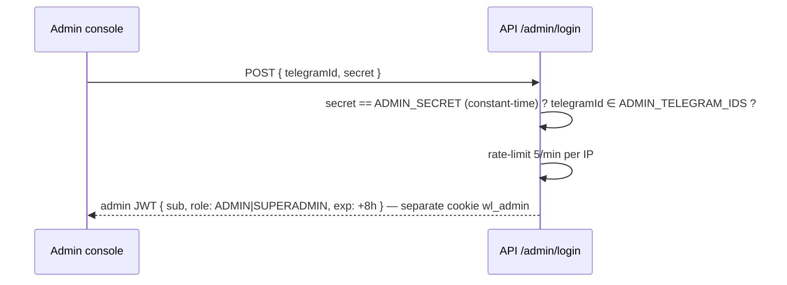

# WARLORDS — Authentication Architecture

> Phase 0 baseline · Implementation: Phase 1 · Zero custom crypto — everything below is Telegram-official + stdlib.

---

## 1. Identity Model

| Concept | Storage | Rule |
|---|---|---|
| **Identity** | `users.telegramId` (unique, int64-as-string) | username is display-only, NEVER identity |
| **Game persona** | `players` (1:1 user) | created in the same tx as first login |
| **Session** | JWT HS256, 7d, sliding refresh | cookie `wl_session` HttpOnly+Secure+SameSite=Lax+Path=/ |
| **Roles** | `users.role` ∈ USER·ADMIN·SUPERADMIN | checked per request by middleware + route guards |

## 2. Flow A — Mini App Login (primary)

Notes:
- `initData` is accepted from the request body **once** and never echoed/logged/stored.
- Verification failures → `INVALID_INIT_DATA` (401). Stale auth_date → same code (client re-opens app to refresh).
- Sliding refresh: authenticated requests with `exp - now < 48h` get a fresh cookie (silent session continuity).
- Every subsequent request: middleware validates JWT + ban status (`users.isBanned`, with `banExpiresAt` support for temp bans) → 401/403 codes.

## 3. Flow B — Dev Impersonation (non-production ONLY)

Purpose: exercise the Mini App in a plain browser during development. Guarded by env + secret + allowlist + audit; **compiled out of production behavior** (route returns 404 when NODE_ENV=production).

## 4. Flow C — Admin Login

Admin cookie is **separate** from player session (a admin browsing the game as player never carries admin powers in the player context). All admin routes require the admin cookie + role guard + audit.

## 5. Guards & Failure Map

| Check | Failure code |
|---|---|
| missing/expired session | `UNAUTHORIZED` / `SESSION_EXPIRED` |
| bad initData signature/age | `INVALID_INIT_DATA` |
| banned user (perm or until banExpiresAt) | `BANNED` (+ reason + expiry in details) |
| role too low | `FORBIDDEN` |
| clan role insufficient | `CLAN_ROLE_REQUIRED` |

## 6. Secrets (summary — full register in SECURITY.md §5)

`JWT_SECRET` ≥32 random bytes, env-only, rotation kills sessions (acceptable, documented). `ADMIN_SECRET` never used as a bearer token by itself — always paired with allowlisted telegramId. `TELEGRAM_BOT_TOKEN` used for HMAC derivation + Bot API only, server-side only.
