# WARLORDS — Database Design

> Prisma schema: `prisma/schema.prisma` (single source of truth).
> Dev driver: SQLite (sandbox) · Production target: PostgreSQL (Supabase).
> The schema is PG-compatible by design: no SQLite-specific behavior is relied upon; enums are enforced at the application layer (Zod + TS unions) because Prisma enums are unsupported on SQLite.

---

## 1. Design principles

1. **Ledger, not mutatio** — every economic delta appends to `resource_transactions` with `balanceAfter`, reason and reference. Wallets are the cache; the ledger is the truth.
2. **Catalog vs. instance split** — static game content (`unit_types`, `commanders`, `items`, `technologies`, `quests`, `achievements`) lives in catalog tables seeded from typed config (`src/lib/game/config`). Player-owned rows reference catalogs by id. Balance patches therefore never require schema changes.
3. **Denormalize for read speed, carefully** — `clanId/clanRole` on Player, `memberCount` on Clan, `currentHp` on WorldBoss. All denormalized fields are updated inside the same transaction as their source.
4. **Deterministic combat persistence** — `battles.seed` + `battles.configVersion` + per-round JSON snapshots make any battle byte-for-byte replayable.
5. **Delete nothing** — bans, cancellations and closures are soft states. Economy history is immutable.
6. **Idempotency as data** — `idempotency_keys` table backs `Idempotency-Key` headers on sensitive POSTs (market fill, resource adjust, reward claims).

---

## 2. ERD (logical)

```mermaid
erDiagram
    USER ||--o| PLAYER : "has"
    USER ||--o{ ADMIN_AUDIT_LOG : "actor"
    USER ||--o{ ANNOUNCEMENT : "author"

    PLAYER ||--|| RESOURCE_WALLET : "wallet"
    PLAYER ||--o{ RESOURCE_TRANSACTION : "ledger"
    PLAYER ||--|| CITY : "capital"
    CITY ||--o{ BUILDING : "has"
    CITY ||--o| TERRITORY : "anchored at"

    UNIT_TYPE ||--o{ PLAYER_UNIT : "instance"
    PLAYER ||--o{ PLAYER_UNIT : "owns"
    UNIT_TYPE ||--o{ TRAINING_QUEUE_ITEM : "being trained"
    PLAYER ||--o{ TRAINING_QUEUE_ITEM : "queue"
    PLAYER ||--o{ MARCH : "sends"
    MARCH }o--o| PLAYER : "targets"
    MARCH }o--o| TERRITORY : "targets"
    MARCH ||--o| BATTLE : "resolves into"

    COMMANDER ||--o{ PLAYER_COMMANDER : "unlocked as"
    PLAYER ||--o{ PLAYER_COMMANDER : "owns"
    PLAYER_COMMANDER ||--o{ COMMANDER_EQUIPMENT : "slot-bound"
    ITEM ||--o{ COMMANDER_EQUIPMENT : "equipped"
    ITEM ||--o{ INVENTORY_ITEM : "stack"
    PLAYER ||--o{ INVENTORY_ITEM : "owns"

    TECHNOLOGY ||--o{ PLAYER_TECHNOLOGY : "progress"
    PLAYER ||--o{ PLAYER_TECHNOLOGY : "researches"

    TERRITORY }o--o| PLAYER : "owned by"
    TERRITORY ||--o{ BATTLE : "site of"
    PLAYER ||--o{ BATTLE : "attacker"
    PLAYER ||--o{ BATTLE : "defender"
    BATTLE ||--o{ BATTLE_ROUND : "rounds"
    BATTLE ||--o{ BATTLE_LOG : "reports"
    PLAYER ||--o{ SCOUT_REPORT : "sent"
    PLAYER ||--o{ SCOUT_REPORT : "received"

    QUEST ||--o{ PLAYER_QUEST : "assigned as"
    PLAYER ||--o{ PLAYER_QUEST : "tracks"
    ACHIEVEMENT ||--o{ PLAYER_ACHIEVEMENT : "unlocked"
    PLAYER ||--o{ PLAYER_ACHIEVEMENT : "earns"

    CLAN ||--o{ CLAN_MEMBER : "roster"
    PLAYER ||--o| CLAN_MEMBER : "membership"
    PLAYER ||--o| CLAN : "leader of"
    CLAN ||--o{ CLAN_INVITATION : "invites"
    CLAN ||--o{ CLAN_MESSAGE : "chat"
    CLAN ||--o{ CLAN_WAR : "declares"
    CLAN_WAR ||--o{ CLAN_WAR_PARTICIPATION : "scores"

    PLAYER ||--o{ MARKET_ORDER : "sells"
    MARKET_ORDER ||--o{ MARKET_TRANSACTION : "fills"
    PLAYER ||--o{ MARKET_TRANSACTION : "buys"

    SEASON ||--o{ LEADERBOARD_SNAPSHOT : "snapshots"
    WORLD_BOSS ||--o{ WORLD_BOSS_DAMAGE : "contributions"
    WORLD_BOSS ||--o{ BATTLE : "raid fights"
    GAME_EVENT }o--o| PLAYER : "targets"

    PLAYER ||--o{ NOTIFICATION : "receives"
    PLAYER ||--o{ SPY_MISSION : "runs"
    PLAYER ||--o{ SPY_MISSION : "victim"
```



---

## 3. Entity catalog

### 3.1 Identity & access

| Table | Purpose | Key fields & constraints |
|---|---|---|
| `users` | Telegram identity + platform role | `telegramId` **unique** (string int64 — never username as identity); `role` = USER·ADMIN·SUPERADMIN; ban fields (`isBanned`, `banReason`, `banExpiresAt`) |
| `admin_audit_logs` | Every admin action, queryable | `actorUserId` FK, `action`, `targetType+targetId`, `before/after` JSON, `reason`, `ip`; index `(actorUserId, createdAt)`, `(targetType, targetId)` |
| `idempotency_keys` | Anti double-submit | `key` **unique**, `action`, `playerId?`, `expiresAt` (TTL-indexed) |

### 3.2 Player & economy

| Table | Purpose | Key fields & constraints |
|---|---|---|
| `players` | Game persona | `userId` **unique**; `level, xp(BigInt), power(BigInt), honor(BigInt), reputation enum-string, reputationScore, gems(BigInt), energy, energyUpdatedAt, seasonPoints, stats Json`; denormalized `clanId, clanRole`; index `(power)`, `(honor)` for leaderboards |
| `resource_wallets` | Current balances | `playerId` **unique**; `gold/wood/iron/food/crystal` BigInt; `capacityUpdatedAt` |
| `resource_transactions` | Immutable ledger | `playerId`, `resource` enum-string, `delta` BigInt (signed), `balanceAfter` BigInt, `reason` (quest_reward, building_upgrade, battle_loot, market_buy, admin_adjust…), `refType/refId` polymorphic link, `metadata Json`; index `(playerId, createdAt)`, `(playerId, reason)` |

### 3.3 City & buildings

| Table | Purpose | Key fields & constraints |
|---|---|---|
| `cities` | Player capital | `playerId` **unique**; `name`; `x,y` map anchor; **unique `(x,y)`** |
| `buildings` | Per-building state | **unique `(cityId, type)`**; `level`; construction fields: `isConstructing, upgradeStartedAt, upgradeCompletesAt, pendingLevel` (single construction slot enforced by service) |

### 3.4 Army

| Table | Purpose | Key fields & constraints |
|---|---|---|
| `unit_types` | Catalog: units | `id` slug PK; `class` INFANTRY·RANGED·CAVALRY·SIEGE; `tier, attack, defense, health, speed, foodUpkeep, carryCapacity, trainingCost Json, trainingTimeSec`; **counters as data**: `strongAgainst Json, weakAgainst Json` |
| `player_units` | Available army | **unique `(playerId, unitTypeId)`**; `count` |
| `training_queue_items` | In-progress training | `playerId`, `unitTypeId`, `count`, `startedAt`, `completesAt`, `status`; index `(playerId, completesAt)` |
| `marches` | Army movements | `type` ATTACK·SCOUT·REINFORCE·RETURN; `units Json` (snapshot); `departedAt, arrivesAt, status`; target = player XOR territory XOR boss; FK to resulting `battleId` |

### 3.5 Commanders & equipment

| Table | Purpose | Key fields & constraints |
|---|---|---|
| `commanders` | Catalog | `rarity` COMMON…MYTHIC; `baseStats Json, skills Json, passive Json`; versioned by `configVersion` |
| `player_commanders` | Owned instances | **unique `(playerId, commanderId)`**; `level, xp` |
| `items` | Catalog: equipment & consumables | `slot` WEAPON·ARMOR·HELMET·RING·AMULET·CONSUMABLE·CHEST; `rarity`; `stats Json, effects Json`; `stackable, sellable, basePrice` |
| `inventory_items` | Owned stacks | **unique `(playerId, itemId)`**; `quantity` |
| `commander_equipment` | Slot bindings | **unique `(playerCommanderId, slot)`**; FK item |

### 3.6 Technology

| Table | Purpose | Key fields & constraints |
|---|---|---|
| `technologies` | Catalog incl. prerequisites | `branch` MILITARY·ECONOMY·DEFENSE·SCIENCE·SCOUTING; `maxLevel`; `prerequisites Json` ([{technologyId, level}]); `costPerLevel Json, effectsPerLevel Json, researchTimeSecPerLevel` |
| `player_technologies` | Research progress | **unique `(playerId, technologyId)`**; `level, researching, researchCompletesAt` |

### 3.7 World, territory, combat

| Table | Purpose | Key fields & constraints |
|---|---|---|
| `territories` | Persistent map cells | **unique `(x,y)`**; `type` (PLAYER_CITY·NPC_VILLAGE·RESOURCE_ZONE·MINE·FOREST·MOUNTAIN·BOSS_ZONE·SPECIAL); optional `ownerPlayerId`, `cityId` **unique** (1:1 with city); `defenseStrength, production Json, strategicValue` |
| `battles` | One row per engagement | `type` PVP_ATTACK·PVE·TERRITORY_ASSAULT·SCOUT·BOSS_RAID; `seed` (determinism), `configVersion`; attacker/defender FKs, `territoryId?`, `bossId?`, `marchId?`; `result` ATTACKER_WIN·DEFENDER_WIN·DRAW; `loot Json, honorDelta, reputationDelta, energySpent`; indexes on both participants + `createdAt` |
| `battle_rounds` | Round-by-round record | `battleId`, `roundNumber`; `side, unitsCommitted Json, unitsLost Json, damageDealt BigInt, events Json`; index `(battleId, roundNumber)` |
| `battle_logs` | Per-participant reports | `battleId, playerId, role` (ATTACKER·DEFENDER·CLANMATE), `content Json` (pre-formatted report), `isRead`; index `(playerId, createdAt)` |
| `scout_reports` | Spy/scout results | attacker/target FKs; `data Json`; `expiresAt` (fog of war TTL) |

### 3.8 Quests & achievements

| Table | Purpose | Key fields & constraints |
|---|---|---|
| `quests` | Catalog | `type` MAIN·DAILY·WEEKLY·ACHIEVEMENT·CLAN·EVENT; `objectiveType` (BUILD_UPGRADE, TRAIN_UNITS, COLLECT_RESOURCE, WIN_BATTLES, SPEND_RESOURCE, REACH_POWER, JOIN_CLAN…); `objectiveTarget Json`, `reward Json`, `repeatable, cooldownHours, prerequisiteQuestIds Json, isActive` |
| `player_quests` | Assignments/progress | `playerId, questId`; `progress, target, status` ACTIVE·COMPLETED·CLAIMED·EXPIRED; `expiresAt`; index `(playerId, status)` — repeating quests create new rows |
| `achievements` / `player_achievements` | Permanent progression | unique `(playerId, achievementId)`, `unlockedAt` |

### 3.9 Clans & war

| Table | Purpose | Key fields & constraints |
|---|---|---|
| `clans` | Clan profile | `name` unique, `tag` unique; `leaderPlayerId`; `level, xp, trophies, memberCount (denorm.)`; `treasury Json, settings Json` (join policy, war preference) |
| `clan_members` | Roster | `playerId` **unique** (≤1 clan per player); `role` LEADER·OFFICER·MEMBER; `contribution`; index `(clanId)` |
| `clan_invitations` | Join pipeline | status PENDING·ACCEPTED·DECLINED·EXPIRED; `expiresAt` |
| `clan_messages` | Clan chat history | `(clanId, createdAt)` index |
| `clan_wars` | War lifecycle | status DECLARED·PREPARATION·BATTLE·FINISHED; score pair; `winnerClanId?`; `config Json` (phases, cooldown); both clans FK'd |
| `clan_war_participations` | Per-member score | **unique `(warId, playerId)`** |

### 3.10 Market, seasons, leaderboard

| Table | Purpose | Key fields & constraints |
|---|---|---|
| `market_orders` | Book | `orderType` SELL·BUY; `resource` or `itemId` (one set); `unitPrice BigInt, quantity, filledQuantity`; `status` OPEN·PARTIAL·FILLED·CANCELLED·EXPIRED; escrow noted in ledger; index `(status, createdAt)` |
| `market_transactions` | Fills | FK order + buyer + seller; `quantity, unitPrice, total, fee BigInt` |
| `seasons` | Ranked periods | `number` unique; `startsAt/endsAt`; `status` UPCOMING·ACTIVE·FINISHED; `config Json` (duration, rewards) |
| `leaderboard_snapshots` | Rankings | `category` POWER·MILITARY·WEALTH·TERRITORY·HONOR·CLAN·BOSS_DAMAGE; `period` WEEKLY·SEASONAL·ALL_TIME; `seasonId?`; `playerId, rank, score`; index `(category, period, rank)` |

### 3.11 Bosses, events, notifications

| Table | Purpose | Key fields & constraints |
|---|---|---|
| `world_bosses` | Global raid state | `maxHp/currentHp BigInt`; `spawnedAt, endsAt, status`; `config Json` |
| `world_boss_damages` | Contribution | **unique `(bossId, playerId)`**; `damage BigInt, hits, lastHitAt`; drives damage leaderboard |
| `game_events` | Server-driven events | `type` GOLD_RUSH·BANDIT_ATTACK·PLAGUE·FIRE·MERCHANT_FLEET·RARE_METEOR·NPC_INVASION·…; `scope` GLOBAL·PLAYER·CLAN; `startsAt/endsAt, config Json, status` |
| `notifications` | Outbox | `playerId`; `type` (ATTACK_INCOMING, ATTACK_RESULT, CONSTRUCTION_COMPLETE, TRAINING_COMPLETE, QUEST_COMPLETED, REWARD, CLAN_INVITE, CLAN_WAR, WORLD_BOSS, EVENT, RANK_CHANGE); `data Json`; `isRead, deliveredVia` IN_APP·BOT·BOTH; index `(playerId, isRead, createdAt)` |
| `announcements` | Admin broadcast | audience ALL·CLAN·PLAYER; `isActive` |

### 3.12 Post-MVP (schema-ready, implemented after MVP)

`diplomacy_relations` (ALLIANCE·PEACE·WAR·TRADE_AGREEMENT·EMBARGO between players/clans) and `spy_missions` (mission type, success chance, duration, result JSON, counter-spy hooks) — tables exist from day one so later phases are additive, not migrative.

---

## 4. Indexing strategy (hot paths)

| Query | Index |
|---|---|
| Wallet/ledger history page | `resource_transactions (playerId, createdAt DESC)` |
| Leaderboard (power/honor) | `players (power)`, `players (honor)` + snapshot table |
| My battles / defender battles | `battles (attackerPlayerId, createdAt)`, `(defenderPlayerId, createdAt)` |
| Unread notifications badge | `notifications (playerId, isRead, createdAt)` |
| Open market book | `market_orders (status, createdAt)` (+ service-side sort by price) |
| Map viewport fetch | `territories (x, y)` range via unique composite |
| Reconciler sweeps | `training_queue_items (playerId, completesAt)`, `marches (arrivesAt, status)`, `buildings (upgradeCompletesAt)` partial use via status fields |
| Quest list | `player_quests (playerId, status)` |

## 5. Transaction boundaries (economy safety)

All sensitive operations run in `db.$transaction` with explicit ordering:

```
BUY from market:
  BEGIN
    1. lock/read order row (updatewhere / unique re-check)
    2. re-validate seller balance & item stock, order status=OPEN/PARTIAL, price, expiry
    3. debit buyer wallet  → ledger row (balanceAfter)
    4. credit seller wallet → ledger row
    5. transfer item / resource
    6. update order (filledQuantity, status)
    7. insert market_transaction
  COMMIT  (any failure → full rollback; ledger untouched)
```

Concurrency on SQLite dev = serialized writers (acceptable for sandbox); PostgreSQL production uses row locks + the same transaction shape. `idempotency_keys` guards client retries.

## 6. PostgreSQL migration notes

1. Switch `datasource` provider to `postgresql` + `DATABASE_URL` to Supabase (pooled connection string).
2. Add Prisma `enum` blocks (optional polish) — app-layer validation already guards values.
3. `prisma migrate deploy` (initial baseline migration generated in Phase 1).
4. Enable row-level security ONLY if exposing Supabase directly — we do not; all access flows through the API.

---

## IMPLEMENTED — Phase 2 status (schema is migrated & seeded)

**Migration policy.** Sandbox dev runs SQLite; migrations are committed under
`prisma/migrations/` (baseline: `20260829175821_baseline`). At deploy time the
datasource provider flips to `postgresql` and a fresh PG baseline is cut
(`prisma migrate dev --name baseline` against the Supabase URL) — the schema is
written PG-first (no SQLite-specific behavior; enum-likes are app-enforced
strings, money is BigInt, JSON columns are PG `jsonb`-ready).

**Table-name contract (user-facing list ↔ Prisma model):**

| Table | Prisma model | Notes |
|---|---|---|
| users | `User` | Telegram identity, ban state, role |
| players | `Player` | progression + premium/action currencies; `stats` JSON governed by the typed catalog (`config/stats.ts`); `power` is a derived cache (see Phase 4 semantics below) |
| cities | `City` | unique (x,y) capital |
| buildings | `Building` | unique (cityId,type); timer columns for lazy-tick upgrades |
| resources | `ResourceWallet` | per-player balance cache — ledger is the truth |
| resource_transactions | `ResourceTransaction` | immutable ledger, balanceAfter chain |
| units | `Unit` | catalog (seeded from `src/lib/game/config/units.ts`) |
| player_units | `PlayerUnit` | unique (playerId, unitId) stacks |
| commanders | `Commander` | catalog |
| items | `Item` | catalog |
| inventory | `InventoryItem` | unique (playerId, itemId) |
| technologies | `Technology` | catalog with JSON prerequisites |
| player_technologies | `PlayerTechnology` | unique (playerId, technologyId) |
| territories | `Territory` | unique (x,y), optional owner (SetNull) |
| battles | `Battle` | deterministic (seed, configVersion); attacker Restrict |
| battle_rounds | `BattleRound` | unique (battleId, roundNumber, side) |
| battle_logs | `BattleLog` | per-participant rendered reports |
| quests | `Quest` | catalog; JSON objective + reward |
| player_quests | `PlayerQuest` | repeating quests → new rows (no unique) |
| achievements | `Achievement` | catalog |
| clans | `Clan` | unique name + tag; denormalized memberCount (in-tx) |
| clan_members | `ClanMember` | unique playerId (≤1 clan per player) |
| clan_wars | `ClanWar` | attacker/defender Restrict, winner SetNull |
| market_orders | `MarketOrder` | escrow handled in service txs |
| market_transactions | `MarketTransaction` | immutable trade history (Restrict FKs) |
| seasons | `Season` | unique number; status index |
| leaderboards | `Leaderboard` | materialized ranking rows (was leaderboard_snapshots) |
| notifications | `Notification` | outbox: IN_APP + BOT delivery |
| events | `GameEvent` | server-driven events (was game_events) |
| admin_users | `AdminUser` | explicit admin registry (identity stays on User) |
| audit_logs | `AuditLog` | append-only admin audit (was admin_audit_logs) |
| auth_sessions | `AuthSession` | **Phase 3** — one live session per initData: `initDataHash` **unique** (sha256 of raw initData), `tokenHash` **unique** (sha256 of the session JWT — raw token never persisted), `userId` FK **Cascade**, `telegramAuthDate`, `issuedIp/userAgent`, `lastUsedAt`, `expiresAt`, `revokedAt` (logout revocation), index `(userId, expiresAt)` |

Support tables beyond the contract: `training_queue_items`, `player_commanders`,
`commander_equipment`, `scout_reports`, `clan_invitations`, `clan_messages`,
`clan_war_participations`, `world_bosses`, `world_boss_damages`, `announcements`,
`diplomacy_relations` (post-MVP), `spy_missions` (post-MVP), `idempotency_keys`.

**Session semantics (`auth_sessions`, Phase 3).** The login transaction
(`src/lib/auth/session.service.ts`) resolves a replayed identical initData
against the unique `initDataHash` and re-attaches it to the same row while
rotating `tokenHash` — one live session per initData, old token dead
immediately, retries never lock users out; fresh initData mints a new row.
Expired rows of the user are deleted in the same tx; logout sets `revokedAt`.
Every request re-reads the row (`sid` claim → row → tokenHash match →
`revokedAt`/`expiresAt` → user role/ban), making the DB the session and
authorization authority.

**Cascade policy (enforced in schema):** owned instance data → `Cascade`;
historical/ledger records → `Restrict`; catalog FKs → `Restrict` (catalogs are
soft-disabled via `isActive`); optional soft references → `SetNull`. Every
mutable table carries `updatedAt` (`@updatedAt`); append-only tables carry
`createdAt` only.

**Player-row semantics (`players`, Phase 4 — no new tables).** Phase 4 added no
schema; it pinned down how two existing columns are governed:

- `players.stats` (Json) is now a **typed counter store**: the single source of
  truth is the catalog in `src/lib/game/config/stats.ts` (12 append-only
  counters — battlesWon…questsCompleted). The read path normalizes any stored
  blob against the catalog (unknown keys dropped, missing keys zero-filled,
  non-conforming values zeroed); the write path (`recordPlayerStats`) accepts
  only positive-integer deltas for catalog keys. Bootstrap zero-fills the record
  (`emptyPlayerStats()`), so the column is always a complete, conforming record.
- `players.power` (BigInt) is a **derived cache**, not state. It is written ONLY
  by `recalculatePlayerPower` (`power.service.ts`), which recomputes from real
  server-owned rows (player_units joined with the unit catalog, buildings,
  researched player_technologies) using the bps weights in
  `config/power.ts`. Clients have no write path; a tampered value heals on the
  next recalculation, and the profile/state endpoints return the freshly
  computed value. Bootstrap computes the initial power as its final step.

**Registration concurrency semantics (Phase 4).** `Player.userId` UNIQUE is the
hard guarantee that one user owns at most one player. On top of it, first login
runs through `ensurePlayer` (`player-registration.service.ts`): idempotent
(existing players short-circuit to one read), race-safe (a P2002 unique-race
loser re-attaches to the winner's row), name sanitized server-side. The whole
login transaction is wrapped by an in-process registration lock
(`withRegistrationLock`) + bounded retry (`withWriteRetry`: P2002 races and
transient SQLite write contention P1008/BUSY) under generous transaction bounds
(`REGISTRATION_TX_OPTIONS {maxWait: 10s, timeout: 20s}`) — retried or parallel
Mini App logins converge on exactly one player and can never fork a second one.

**Seeded transaction pattern (sensitive operations).** `bootstrapPlayer(tx, …)`
(`src/lib/game/services/player-bootstrap.service.ts`) creates the complete
player state — player (with zero-filled typed stats), wallet, ledger faucet
rows, city, 17 starter buildings, starter army, starter quests, welcome
notification, and finally the initial power recalculation — inside ONE
`db.$transaction`. It is consumed by the seed and by the auth flow (first login
via `ensurePlayer`), so user, session and full player state commit atomically.
All future money-touching services follow the same interactive-transaction
pattern with ledger appends and `balanceAfter` chain inside the tx boundary.

**Verification.** `bun run db:verify` asserts on the real database: ledger
Σdelta == wallet per resource, `balanceAfter` chain consistency, per-player
completeness, in-DB config reference integrity, coordinate uniqueness.
`bun run test` guards the config catalogs before they can reach the DB.
