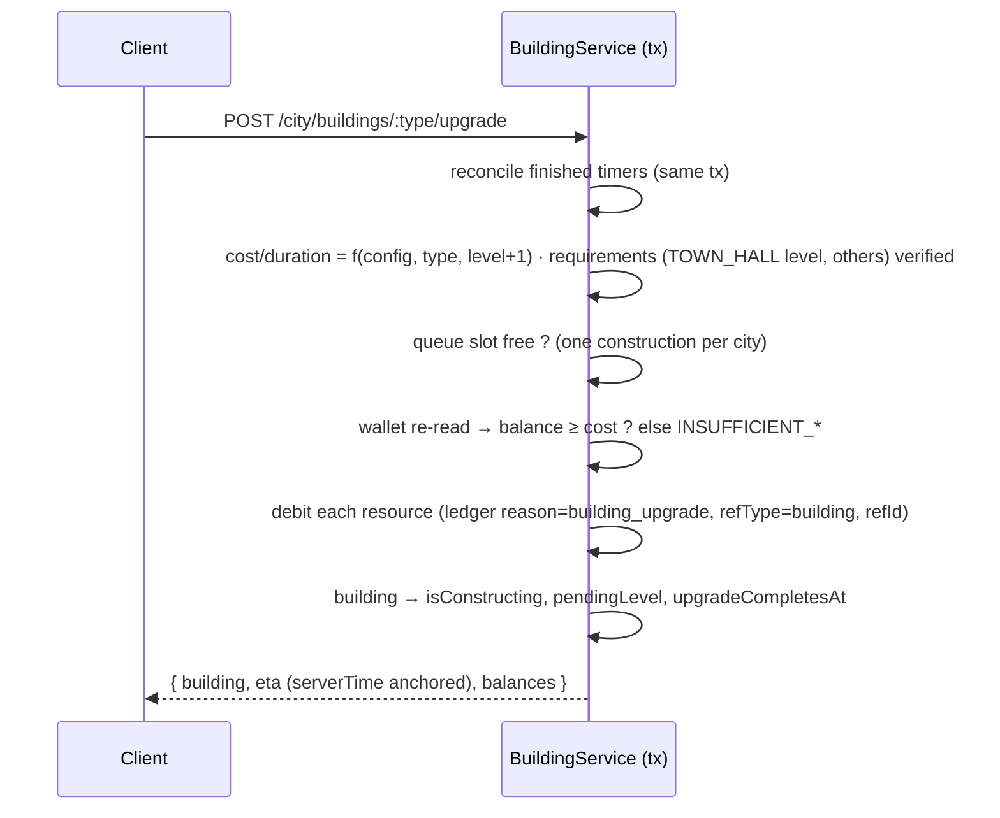
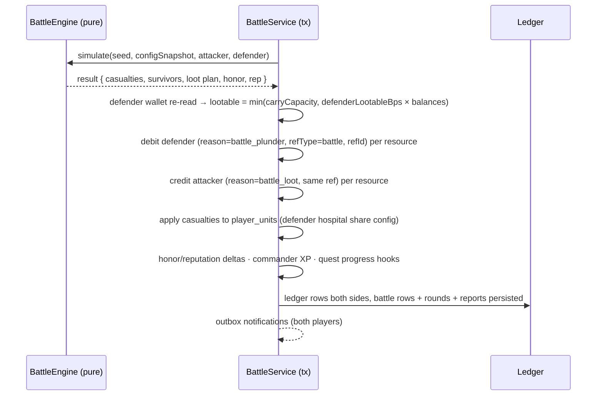
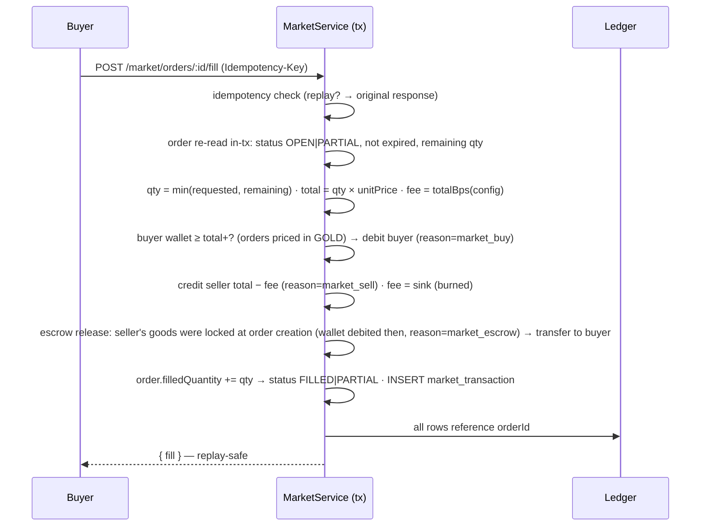

# WARLORDS — Economy Architecture & Transaction Flows

> Phase 0 baseline · Implementation: Phase 2 (+ market later) · Every number server-computed, every delta ledgered, nothing negative, nothing duplicated.

---

## 1. Economic Principles

1. **Single writer per wallet**: wallet rows change only inside transactions that re-read the balance in-tx (`SELECT … → compute → UPDATE … WHERE balance ≥ cost` semantics via service guard; PG CHECK constraints added at migration for belt-and-braces).
2. **Append-only ledger**: `resource_transactions(playerId, resource, delta, balanceAfter, reason, refType?, refId?, metadata?)`. Wallets are a cache; the ledger is truth. Economy reports = ledger aggregates.
3. **Integer math only**: amounts BigInt, rates/percentages basis-points. No floats anywhere in money paths.
4. **Idempotency at the edge**: sensitive commands carry `Idempotency-Key`; replays return the original response (24h TTL).
5. **Faucets & sinks are config**: production rates, costs, refunds, fees — all in `game/config`, tunable without deploys.

## 2. Money Types

| Kind | Fields | Capacity | Notes |
|---|---|---|---|
| Storable | gold · wood · iron · food · crystal | warehouse capacity (derived from building levels + tech) | overflow = accrual stops at cap (never destroyed silently; UI shows "full") |
| Account-bound | gems | ∞ | premium; only minted by rewards/purchases (admin-audited) |
| Action point | energy | cap 100 (+config) | regen 1/5min config; consumed by attack/scout; blocks combat when short |

## 3. Canonical Transaction Flows

### 3.1 Production accrual & collect (lazy-tick)

```mermaid
sequenceDiagram
    participant C as Client
    participant S as CityService (tx)
    participant L as Ledger

    C->>S: POST /city/collect  (intent only — no amounts)
    S->>S: read wallet + city buildings + capacity
    S->>S: Δt = now − capacityUpdatedAt ; accrued = min(rate×Δt, cap − balance) per resource
    S->>S: UPDATE wallet SET bal += accrued, capacityUpdatedAt = now  (single UPDATE, in-tx re-read)
    S->>L: INSERT ledger rows (reason=production, per resource with balanceAfter)
    S-->>C: { collected: {...}, balances, capacity, serverTime }
```

Guarantees: double-collect impossible (`capacityUpdatedAt` advances in the same tx); cap never exceeded; zero amounts produce zero ledger rows.

### 3.2 Spend — building upgrade



### 3.3 Spend — unit training (with upkeep model)

Same skeleton as 3.2 plus: debit `trainingCost × count` (reason=unit_training) → queue rows; on completion units join `player_units`. **Upkeep** applies continuously: food accrual rate is reduced by `Σ units.foodUpkeep` inside the rate computation of 3.1 (upkeep can make net food negative down to 0 — starvation rules config-driven: units never die of hunger in MVP, production simply stalls at 0 with a UI warning).

### 3.4 Battle loot transfer (combat settlement)



### 3.5 Market escrow fill (post-MVP flow, fully specified now)



Escrow rule: **goods move at order creation** (seller debited into escrow), price moves only at fill → nobody can double-spend listings; cancellation returns escrowed goods (ledger reason=market_escrow_refund).

### 3.6 Admin adjustment (support flow)

`POST /admin/players/:id/adjust-resources {resource, delta, reason}` → Idempotency-Key required → tx: clamp result ≥ 0 → ledger row `reason=admin_adjust` (+ actor, audit log before/after) → outbox notification to player. Every mint/burn visible in `/admin/economy/overview` (24h mint/burn per resource from ledger aggregates).

## 4. Invariants (engine asserts + service guards + migration constraints)

| Invariant | Enforcement |
|---|---|
| balance ≥ 0 after every op | in-tx re-read + guard; PG CHECK (`gold >= 0`, …) in Phase 1 migration |
| ledger Δ = balanceAfter − previous balanceAfter (per wallet, per resource) | service writes both atomically; integrity sweep endpoint in Phase 10 |
| no double-effect under retries | Idempotency-Key on: attack, claim, market fill/cancel, admin adjust |
| no float rounding drift | BigInt + bps everywhere |
| capacity never exceeded by accrual | min(cap − balance, accrued) computation |
| escrow ≠ spendable twice | goods leave wallet at order creation |

## 5. Inflation Control (faucets → sinks)

| Faucets | Sinks |
|---|---|
| passive production · quest/achievement rewards · battle plunder · event bonuses · clan donations (redistribution) | building/training/research costs · training upkeep · battle casualties (units = burned investment) · market fee burn · hospital healing cost · territory upkeep (post-MVP) |

Config exposes a `economy drains` report (Phase 10): mint vs burn per day from ledger — the balance lever is config, not code.

## 6. Anti-Exploit Map

| Attack | Counter |
|---|---|
| client sends amounts | ignored — commands carry intent only (Zod strips unknown keys) |
| concurrent double-spend | single tx + in-tx re-read; SQLite serializes (dev), PG row locks (prod) |
| retry storm → double rewards | idempotency keys + quest CLAIMED status re-check in-tx |
| negative-delta inputs | validation bounds + unsigned paths (no endpoint accepts signed deltas except admin, which audits) |
| ledger tampering | no delete/update paths on ledger tables anywhere in the codebase (append-only by construction) |
