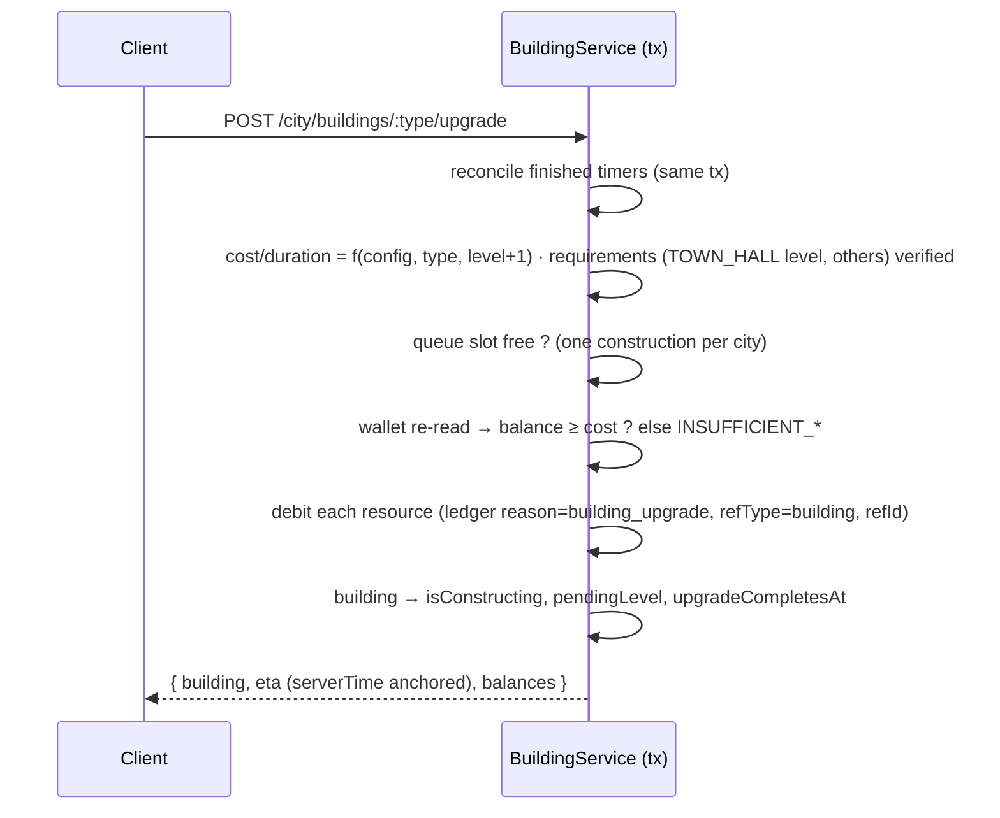
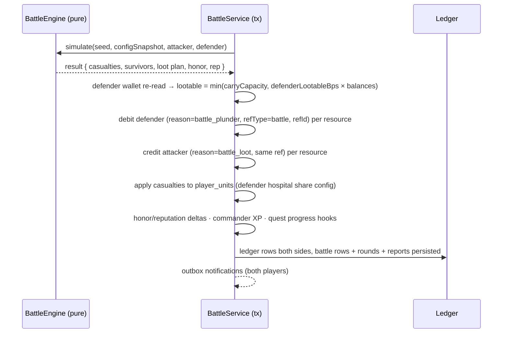
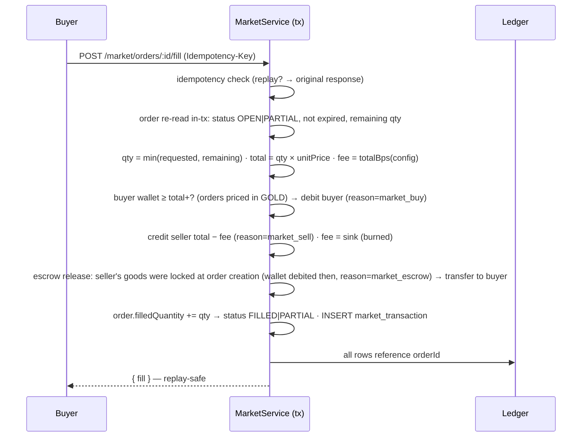

# WARLORDS — Economy Architecture & Transaction Flows

> Phase 0 baseline · **Economy core: IMPLEMENTED — Phase 5** (config · ledger write path · idempotent grants · race safety · admin adjust · read APIs; battle/market flows below are specified now and land with their phases) · Every number server-computed, every delta ledgered, nothing negative, nothing duplicated.

---

## 1. Economic Principles

1. **Single writer per wallet**: wallet rows change only inside transactions that re-read the balance in-tx (`SELECT … → compute → UPDATE … WHERE balance ≥ cost` semantics via service guard; PG CHECK constraints added at migration for belt-and-braces).
2. **Append-only ledger**: `resource_transactions(playerId, resource, delta, balanceAfter, reason, refType?, refId?, metadata?)`. Wallets are a cache; the ledger is truth. Economy reports = ledger aggregates.
3. **Integer math only**: amounts BigInt, rates/percentages basis-points. No floats anywhere in money paths.
4. **Idempotency at the edge**: sensitive commands carry `Idempotency-Key`; replays return the original response (24h TTL).
5. **Faucets & sinks are config**: production rates, costs, refunds, fees — all in `game/config`, tunable without deploys.

## 2. Money Types

| Kind | Fields | Capacity | Notes |
|---|---|---|---|
| Storable | gold · wood · iron · food · crystal | config caps in Phase 5 (`RESOURCE_CAPS`: GOLD 5e9 · WOOD/IRON/FOOD 2.5e9 · CRYSTAL 1e9); warehouse capacity derived from building levels + tech arrives with City & Buildings | overflow = accrual stops at cap (never destroyed silently; UI shows "full") |
| Account-bound | gems | `RESOURCE_CAPS.GEMS` = 1e8 (premium — tightest cap on purpose) | premium; only minted by rewards/purchases (admin-audited) |
| Action point | energy | cap 100 (+config) | regen 1/5min config; consumed by attack/scout; blocks combat when short (implemented Phase 4) |

**Phase 5 note:** the five wallet resources live on the `resources` row (`ResourceWallet`), GEMS on `Player.gems` — both storage targets flow through the SAME `resource_transactions` ledger, so `Σ(delta) == balance` reconciles per resource regardless of where the balance is stored.

## 3. Canonical Transaction Flows

### 3.1 Production accrual & collect (lazy-tick)

```mermaid
sequenceDiagram
    participant C as Client
    participant S as CityService (tx)
    participant L as Ledger

    C->>S: POST /city/collect  (intent only — no amounts)
    S->>S: read wallet + city buildings + capacity
    S->>S: Δt = now − capacityUpdatedAt ; accrued = min(rate×Δt, cap − balance) per resource
    S->>S: UPDATE wallet SET bal += accrued, capacityUpdatedAt = now  (single UPDATE, in-tx re-read)
    S->>L: INSERT ledger rows (reason=production, per resource with balanceAfter)
    S-->>C: { collected: {...}, balances, capacity, serverTime }
```

Guarantees: double-collect impossible (`capacityUpdatedAt` advances in the same tx); cap never exceeded; zero amounts produce zero ledger rows.

### 3.2 Spend — building upgrade



### 3.3 Spend — unit training (with upkeep model)

Same skeleton as 3.2 plus: debit `trainingCost × count` (reason=unit_training) → queue rows; on completion units join `player_units`. **Upkeep** applies continuously: food accrual rate is reduced by `Σ units.foodUpkeep` inside the rate computation of 3.1 (upkeep can make net food negative down to 0 — starvation rules config-driven: units never die of hunger in MVP, production simply stalls at 0 with a UI warning).

### 3.4 Battle loot transfer (combat settlement)



### 3.5 Market escrow fill (post-MVP flow, fully specified now)



Escrow rule: **goods move at order creation** (seller debited into escrow), price moves only at fill → nobody can double-spend listings; cancellation returns escrowed goods (ledger reason=market_escrow_refund).

### 3.6 Admin adjustment (support flow)

`POST /admin/players/:id/adjust-resources {resource, delta, reason}` → Idempotency-Key required → tx: clamp result ≥ 0 → ledger row `reason=admin_adjust` (+ actor, audit log before/after) → outbox notification to player. Every mint/burn visible in `/admin/economy/overview` (24h mint/burn per resource from ledger aggregates).

**Phase 5 status:** the core is implemented as a service — `adminAdjustResources` (`economy.service.ts`): signed deltas, note 1–500 chars required, `actorUserId` required, `audit_logs` row (`ADJUST_RESOURCES`, before/after balance maps) written in the SAME serialized transaction, ledger `metadata {actorUserId, note}`, reason `ADMIN_ADJUSTMENT`. The HTTP surface arrives with the Admin panel (Phase 9); the outbox notification is not yet wired.

## 4. Invariants (engine asserts + service guards + migration constraints)

| Invariant | Enforcement |
|---|---|
| balance ≥ 0 after every op | **Phase 5: conditional compare-and-decrement** (`updateMany where field >= amount`) on both storage targets — DB-level, independent of any lock — plus in-tx validate-then-write; PG CHECK (`gold >= 0`, …) remains a Phase 11 belt-and-braces |
| ledger Δ = balanceAfter − previous balanceAfter (per wallet, per resource) | service writes both atomically in the caller's tx; **Phase 5: credits record the CLAMPED delta** so the invariant also holds at the cap; enforced by the integration reconcile helper + `db:verify` |
| no double-effect under retries | **Phase 5: `grantResources` idempotency keys** committed in the same tx as the payout (24h TTL); Idempotency-Key on: attack, claim, market fill/cancel, admin adjust |
| no float rounding drift | BigInt + bps everywhere (Phase 5 math is BigInt-only, `MAX_DELTA` 1e15 ceiling before any math) |
| capacity never exceeded by accrual | min(cap − balance, accrued) computation; **Phase 5: `creditWithCap` clamps credits exactly at the configured cap** — a fully-capped credit applies 0 (no write, no ledger row) |
| escrow ≠ spendable twice | goods leave wallet at order creation (market — post-MVP) |

## 5. Inflation Control (faucets → sinks)

| Faucets | Sinks |
|---|---|
| passive production · quest/achievement rewards · battle plunder · event bonuses · clan donations (redistribution) | building/training/research costs · training upkeep · battle casualties (units = burned investment) · market fee burn · hospital healing cost · territory upkeep (post-MVP) |

Config exposes a `economy drains` report (Phase 10): mint vs burn per day from ledger — the balance lever is config, not code.

## 6. Anti-Exploit Map

| Attack | Counter |
|---|---|
| client sends amounts | ignored — commands carry intent only (Zod strips unknown keys) |
| concurrent double-spend | single tx + in-tx re-read; SQLite serializes (dev), PG row locks (prod) |
| retry storm → double rewards | idempotency keys + quest CLAIMED status re-check in-tx |
| negative-delta inputs | validation bounds + unsigned paths (no endpoint accepts signed deltas except admin, which audits) |
| ledger tampering | no delete/update paths on ledger tables anywhere in the codebase (append-only by construction) |

## 7. Implemented — Phase 5 (Resource & Economy Engine)

The economy core is live: `src/lib/game/config/economy.ts` (data-driven balance surface) + `src/lib/game/services/economy.service.ts` (the single server-side write path) + `src/lib/concurrency/mutex.ts` (per-player serialization) + two GET endpoints. Every statement below is grounded in that code and proven by tests.

### 7.1 Resources & storage split

Six canonical economy resources (`ECONOMY_RESOURCES`, canonical order): **GOLD · WOOD · IRON · FOOD · CRYSTAL** live on the `ResourceWallet` row (the cache); **GEMS** (premium) lives on `Player.gems`. Both storage targets flow through the SAME `resource_transactions` ledger, so `Σ(delta) == balance` reconciles per resource regardless of storage. A missing wallet row is treated as an `INTERNAL_ERROR` (bootstrap bug), never a silent zero.

### 7.2 Reason catalog (closed vocabulary)

`LEDGER_REASONS` in config — every mutation must carry exactly one: `BOOTSTRAP` (first-login faucet) · `QUEST_REWARD` · `BUILDING_UPGRADE` · `UNIT_TRAINING` · `BATTLE_REWARD` · `MARKET_PURCHASE` · `MARKET_SALE` · `ADMIN_ADJUSTMENT`. Unknown reasons are rejected at the write path (`VALIDATION_ERROR`); the history endpoint filters by the same set. Adding an economy subsystem means adding its reason HERE first.

### 7.3 Caps & clamping semantics

`RESOURCE_CAPS` (BigInt literals): GOLD 5e9 · WOOD 2.5e9 · IRON 2.5e9 · FOOD 2.5e9 · CRYSTAL 1e9 · GEMS 1e8. `MAX_DELTA = 1e15` is a hard per-mutation ceiling — any |delta| above is rejected `INVALID_AMOUNT` before any math. Credits run through `creditWithCap`: they clamp exactly at the cap and the **CLAMPED delta is what the ledger records**, so the ledger always reconciles to the stored balance; a fully-capped credit applies 0 → no wallet write, NO ledger row (reported via the `skipped` flag). Debits run through `debitBalance` (refuses below zero) and persist via conditional compare-and-decrement.

### 7.4 The single write path (validate-ALL-then-write)

`applyResourceDeltas(tx, playerId, deltas, meta)` runs inside the CALLER's transaction: phase 1 validates everything and plans (unknown resource/reason → `VALIDATION_ERROR`; non-BigInt / zero / oversized delta → `INVALID_AMOUNT`; duplicate resource in one batch → `VALIDATION_ERROR`; any debit beyond balance → typed 409 `INSUFFICIENT_<RESOURCE>` with `details {needed, have}`) — phase 2 persists wallet/Player writes + one ledger row per changed resource (`createMany`). All-or-nothing: a single failure aborts the whole batch and the caller's transaction. Convenience wrappers: `grantResources` (positive amounts; optional idempotency key), `spendResources` (positive costs → all-or-nothing debits). `runEconomyTransaction(playerId, run)` wraps standalone mutations: `withKeyLock('wallet:{playerId}')` → `withWriteRetry` → `db.$transaction` under `ECONOMY_TX_OPTIONS {maxWait: 10s, timeout: 20s}`.

### 7.5 Race-safety layers (honest scope)

1. **Per-player in-process FIFO mutex** (`lib/concurrency/mutex.ts`): keyed promise chains — same key queues in arrival order, different keys run in parallel; a failing critical section never poisons the chain; idle keys are evicted; deliberately NOT reentrant. This is deterministic serialization for the single-node MVP.
2. **Interactive-tx atomicity** — wallet + ledger + side effects commit or roll back together.
3. **Conditional compare-and-decrement** — the DB-level no-negative guarantee, holding even multi-process.
4. **Bounded transient retry** — `withWriteRetry` for SQLite BUSY/P1008 contention (harmless on PostgreSQL).
5. **Unique idempotency keys** — duplicate-proof grants (unique-constraint arbiter).

PostgreSQL production note: swap/add `SELECT … FOR UPDATE` or advisory locks for cross-process serialization — the in-process mutex is per-process by design.

### 7.6 Idempotent grant contract

`grantResources(tx, playerId, amounts, {idempotencyKey, …})`: key ≤128 chars → sha256 `requestHash` of {playerId, reason, refType, refId, sorted amounts} → the `IdempotencyKey` row (`action: 'resource_grant'`, serialized `responseBody`, `expiresAt = now + 24h`) is created **inside the payout transaction** and commits or rolls back WITH it. Replay within the TTL (key exists, same hash) returns the ORIGINAL result with `replayed: true` — no second payout. Same key with a different payload → 409 `IDEMPOTENT_REPLAY`. A concurrent duplicate that loses the unique race → 409 `IDEMPOTENT_REPLAY` (its tx is unusable; the caller re-issues and lands on the replay path). A crash after apply but before commit leaves ZERO residue (no payout, no key) and a retry works fresh.

### 7.7 Admin adjustment (audited)

`adminAdjustResources({playerId, actorUserId, note, adjustments})` — standalone, runs in its own serialized transaction: note 1–500 chars and actor required; signed BigInt deltas; ledger rows carry `metadata {actorUserId, note}` with reason `ADMIN_ADJUSTMENT`; an `audit_logs` row (`action: 'ADJUST_RESOURCES'`, before/after balance maps as strings, note as reason) is written in the SAME transaction — an untracked adjustment is structurally impossible. Overdraft refused like any other debit.

### 7.8 Invariants & how tests enforce them

| Invariant | Proven by |
|---|---|
| never negative; typed `INSUFFICIENT_*` refusal writes nothing | integration: spend beyond balance → 409 + unchanged balances; spend to exactly zero allowed, next debit fails; contended debits → exactly 1 winner |
| Σ(ledger delta) == balance per resource (incl. clamped credits; zero-applied credits write no row) | integration reconcile helper after parallel mixed ops + overflow tests; `db:verify` on the seeded DB |
| credits clamp exactly at the cap | unit `creditWithCap` boundary math + integration grant past the 5e9 GOLD cap (balance lands exactly at 5e9, `appliedDelta` correct; at-cap grant writes nothing) |
| every delta has a catalog reason | unit catalog invariants + service `assertReason` + history reason-filter tests |
| all-or-nothing mutations | rollback scenario: mixed batch with one impossible debit persists nothing (balances, ledger, idempotency keys) |
| GET-only HTTP surface | integration asserts route modules export exactly `['GET']` + 401 matrix + per-player isolation |

Test scope: 20 unit (config invariants, helper boundary math, predicates, mutex FIFO/parallel/error-isolation/eviction) · 25 integration over real routes + DB (isolated 9100005… telegramId range) · 3 e2e over live HTTP. Counts and scenarios: ROADMAP Phase 5 (5.8).
